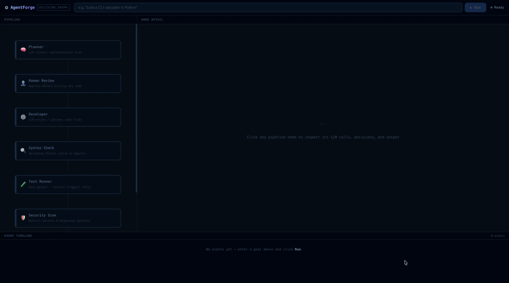

# AgentForge

**Autonomous coding agent that runs entirely on your laptop.**  
Type a goal. It plans, writes code, runs tests, scans for security issues, and commits — while you watch every decision it makes in a live graph.



> No cloud. No API key. No code leaves your machine.

---

## What makes it different

Every other autonomous coding agent — Devin, Copilot Workspace, Amazon Q — sends your code to a cloud server. That's a non-starter for anyone in fintech, healthcare, defence, or enterprise.

AgentForge runs 100% local via [Ollama](https://ollama.ai). The **decision graph UI** is its core differentiator: instead of a black-box spinner, you see every agent decision animate in real time — what it planned, why it retried, what tests failed, what security issues it blocked.

---

## Demo

```
Goal: "build a REST API with user auth and tests in Python"
```

- Planner drafts an implementation spec — you approve before any code runs  
- Developer writes the code to a sandboxed workspace  
- Tester runs pytest — self-heals broken test patterns automatically  
- Security scanner blocks on HIGH/CRITICAL findings  
- Git manager commits to a feature branch, never touches main  

**Result:** working code, passing tests, clean security scan, committed — in under 90 seconds.

---

## Quick start

**Requirements:** Python 3.11+, Node 20+, [Ollama](https://ollama.ai)

```bash
# 1. Pull the model
ollama pull qwen2.5-coder:7b

# 2. Clone and install
git clone https://github.com/agentforge-lab/agentforge-lab
cd agentforge-lab
python -m venv .venv && source .venv/bin/activate
pip install -e .

# 3. Start the backend
agentforge serve

# 4. Start the UI  (new terminal)
cd frontend && npm install && npm run dev

# 5. Open http://localhost:3000, type a goal, click Run
```

**CLI only (no UI):**
```bash
agentforge run "build a CLI calculator in Python" --auto-approve
```

---

## Configure models

AgentForge uses different models per agent. Auto-detect what's running on your machine:

```bash
agentforge models detect --save
```

Or set manually:
```bash
agentforge models set developer qwen2.5-coder:7b
agentforge models set tester   qwen2.5-coder:1.5b
agentforge models list
```

Works with any Ollama model. Also supports Claude and other API models — set `ANTHROPIC_API_KEY` and use model IDs like `claude-haiku-4-5-20251001`.

---

## How the pipeline works

```
Goal
 └─ Planner       — reads goal, drafts implementation spec
     └─ Human checkpoint  — you approve or cancel before code runs
         └─ Developer     — writes code to sandboxed workspace
             └─ Syntax check  — blocks on import/syntax errors
                 └─ Tester    — generates + runs pytest, self-heals failures
                     └─ Security scan  — Bandit, blocks on HIGH/CRITICAL
                         └─ Git manager  — commits to feature branch
```

On any failure the Developer retries with the full error context — test tracebacks, security findings, import errors. Up to 3 attempts before the run is marked failed.

Every step is visible in the decision graph. Click any node to see the LLM calls, the decisions made, retry reasons, and test/security details.

---

## What it builds well today

| Goal | Result |
|---|---|
| CLI tools and scripts | Consistent |
| REST APIs with auth | Consistent |
| Data processing pipelines | Consistent |
| Web scrapers | Consistent |
| Password generators, calculators, converters | Consistent |

---

## What's coming

| Feature | Status |
|---|---|
| Core pipeline + decision graph UI | ✅ Done |
| Per-agent model config | ✅ Done |
| Self-healing test patterns | ✅ Done |
| Large multi-file projects | 🔧 In progress |
| Explainer Agent (reads + explains codebases) | 📋 Next |
| Document generation | 📋 Planned |
| Pro tier (fine-tuned model, PDF export, cloud mode) | 📋 Planned |

---

## Stack

Python · FastAPI · LangGraph · React · Ollama · WebSocket · Bandit · pytest

---

## License

MIT — free to use, modify, and distribute.

---

## Follow the build

Built in public. Star the repo to follow along.
